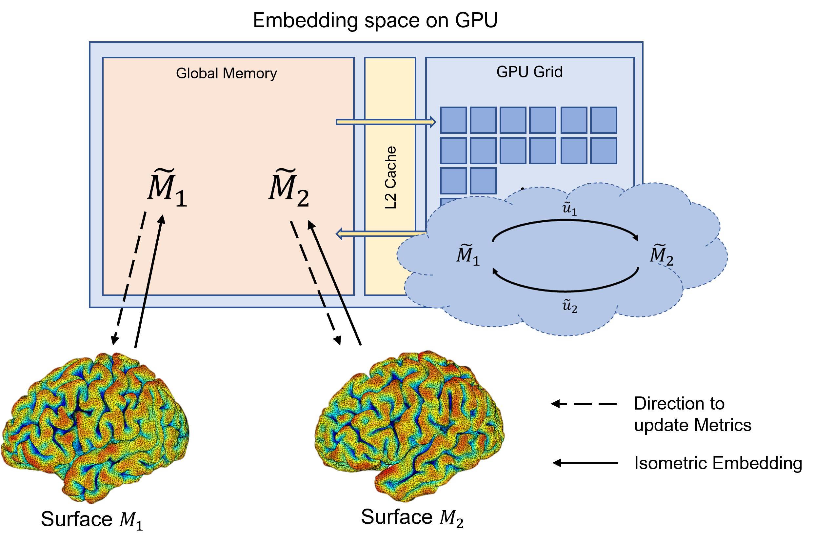

# G-RMOS: GPU-accelerated Riemannian Metric Optimization on Surfaces

This repository contains the official implementation of G-RMOS, introduced in ***"G-RMOS: GPU-accelerated Riemannian Metric Optimization on Surfaces"***. 



See detailed usage instructions below:

## Docker
This software was developed using a workstation with Ubuntu20.04, Nvidia 2080ti GPU (Driver version is 512.15). 
To manage library dependencies, we use Nvidia HPC SDK Docker image {nvcr.io/nvidia/nvhpc:21.5-devel-cuda11.3-ubuntu20.04} as base.
G-RMOS provides a Docker image that includes the proper environment with all dependencies. Note that nvidia-docker must be installed to run on GPU.

```
docker pull jwjo7936/g_rmos:1.0.0
```

To launch the G-RMOS container, run the following:
```
docker run --gpus=all -it -v ~/:/mnt/ jwjo7936/g_rmos:1.0.0
```

## Usage
G-RMOS reqires some parameters to registrate surfaces. 
```
Command arguments with examples (file or parameter)
	 >SourceMesh.obj: Source surface
	 >TargetMesh.obj: Target surface
	 >SourceInitW.raw: Initial source metric (-1: original edge weight)
	 >TargetInitW.raw: Initial target metric (-1: original edge weight)
	 >MaxEigenOrder: Maximum eigen order
	 >StartEigenOrder: Starting eigen order
	 >DeltaT: Time step for total energy
	 >NumSteps: Maximum number of steps for total energy before the final eigen order
	 >FinalNumSteps: Maximum number of steps for total energy at the final eigen order
	 >SourceEF.raw: Output of source eigenfuctions
	 >TargetEF.raw: Output of target eigenfuctions
	 >SourceWeight.raw: Output of optimized source edge weights
	 >TargetWeight.raw: Output of optimized target edge weights
	 >S2T.obj: Output of projection of source to target mesh
	 >T2S.obj: Output of projection of target to source mesh
	 >S2TMap.raw: Output of source to target map
	 >T2SMap.raw: Output of target to source map
	 >MoveSourceOnlyFlag: 1 (only move source), 0 (move both source and target)
	 >SourceInitWeight.raw: Output of initial source edge weights
	 >TargetInitWeight.raw: Output of initial target edge weights
	 >NumFeatures: Number of features for data fidelity term
	 >SourceFeature.raw(32-bit): Source features
	 >TargetFeature.raw: Target features
	 >S2T-Feat.raw: Pullback features by S2T map
	 >T2S-Feat.raw: Pullback features by T2S map
	 >Data_DeltaT: Time step for data term
	 >Data_NumSteps: Maximum number of steps for data term optimization
	 >gamma: 0 fixed (for RMOS) 
	 >gamma_smooth: Ratio for smoothness term (Er/Ef, default: 0) 
	 >type_gamma: Type of gamma_smooth - 0: fixed ratio (default), 1: Er/Ef min ratio, 2: Er/Ef mean ratio
```

## Getting Started


## Example Commands
We provide example hipocampus surfaces and their parameters for G-RMOS. these files are in /workspace/example. To registrate theses surfaces with G-RMOS, run
```
$ cd /workspace/example
$ ../g_rmos source_hippo.obj target_hippo.obj -1 -1 15 10 50 20 20 SourceEF.raw TargetEF.raw SourceWeight.raw TargetWeight.raw S2T.obj T2S.obj S2T.raw T2S.raw 0 SourceInitWeight.raw TargetInitWeight.raw 1 source_hippo_mc.raw target_hippo_mc.raw S2T-Feat.raw T2S-Feat.raw 10 100 0 0.1 1
```


